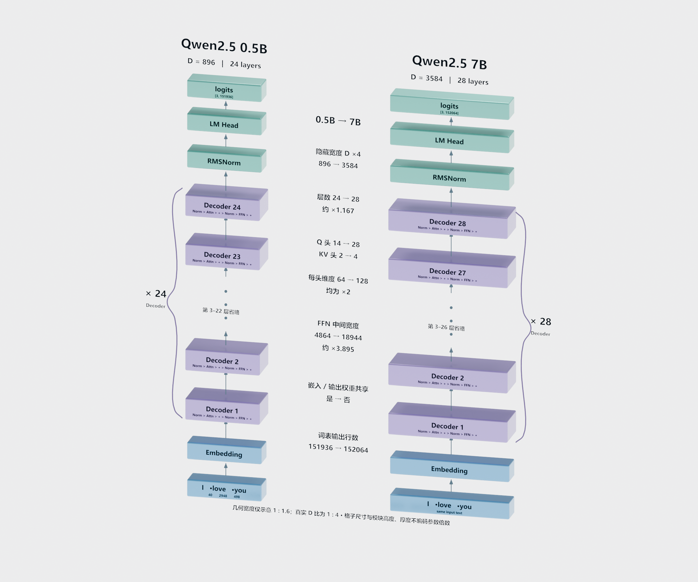
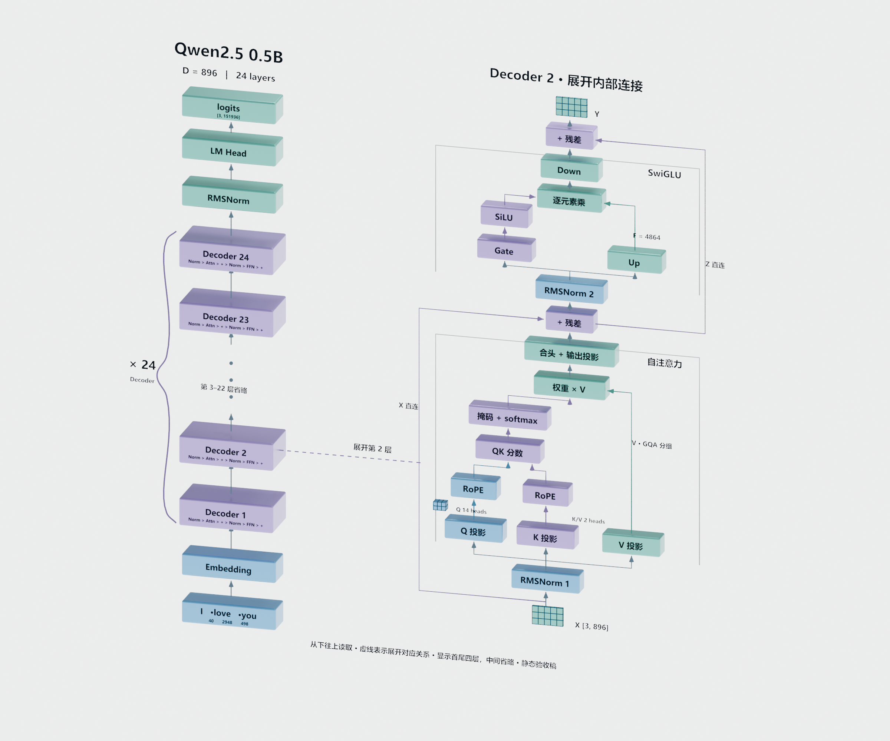
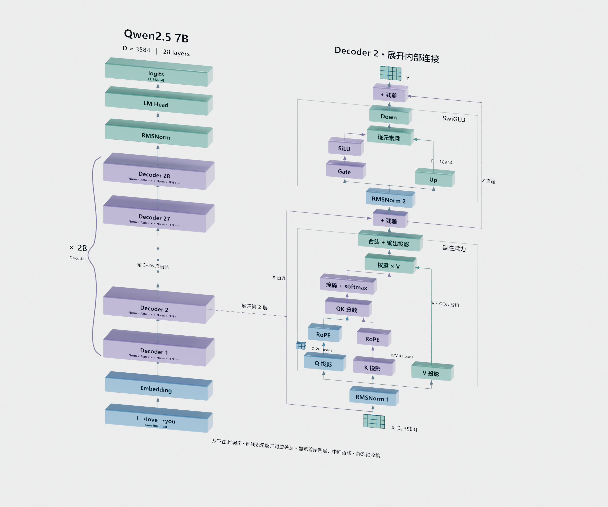

# Qwen2.5 结构示意图

本目录三张图为课程配套的模型结构教学示意图，配合录屏中"模型结构"一节使用。点击图片可看原图。

## 0.5B / 7B 紧凑对照

## 学生 Qwen2.5-0.5B-Instruct：主干与第 2 层展开

## 教师 Qwen2.5-7B-Instruct：主干与第 2 层展开

## 读图提示

从下往上读取。图中四个可见 Decoder 块表示首尾层（[1, 2, L−1, L]），中间层省略，虚线表示第 2 层与展开区的对应关系；Decoder 括号标明 ×24 / ×28。

## 诚实声明

模块物理宽度为压缩示意比例（1:1.6），真实隐藏维度比例是 1:4；块高、块深和体积不代表参数量。

## 两模型真实维度

| 项目 | 0.5B | 7B |
|---|---:|---:|
| Decoder 层数 | 24 | 28 |
| 隐藏维度 D | 896 | 3584 |
| 前馈中间维度 F | 4864 | 18944 |
| 查询头 / KV 头 | 14 / 2 | 28 / 4 |
| 每头维度 | 64 | 128 |
| 词表大小 | 151936 | 152064 |
| 输入输出嵌入权重共享 | 是 | 否 |
